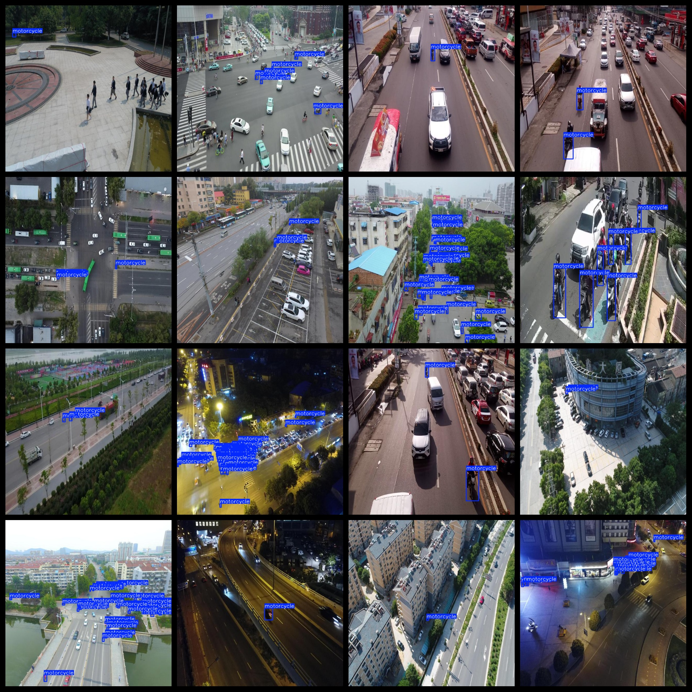
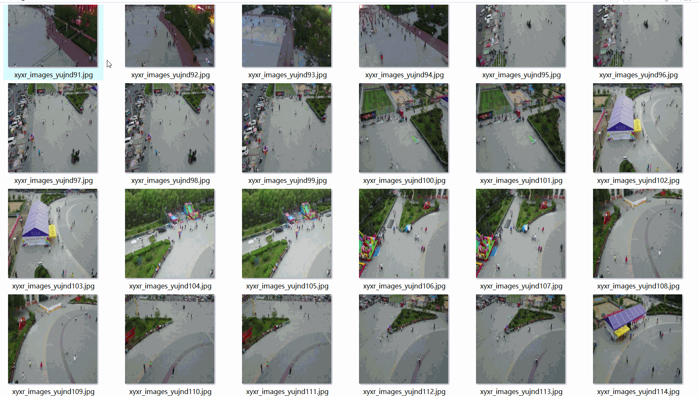

# Aerial Motorcycle Dataset 8409 imagesVOC+YOLO format

The aerial motorcycle dataset consists of 8409 images in VOC+YOLO format.

The dataset is formatted as VOC with additions for YOLO detection.

The package contains three folders: JPEGImages, Annotations, and labels.

In the JPEGImages folder, there are a total of 8409 jpg images.

In the Annotations folder, there are a total of 8409 xml files.

In the labels folder, there are a total of 8409 txt files.

There is only one label type: "motorcycle".

The number of bounding boxes (yolo format category order does not match this) for each label is as follows:

- motorcycle bounding boxes = 54886

The total number of bounding boxes is 54886.

The image resolution is clear.

The images have not been enhanced.

The GitHub repository location is: datasets_sl

The label shape is a rectangle box used for target detection recognition.

Important note: No specification for "021" has been added.

Special notice: The dataset does not guarantee the accuracy or precision of the trained models or weight files. The dataset only provides accurate and reasonable annotations.

The annotation and image details are as follows:

## Images

---

Here is a pay link on Stripe (https://buy.stripe.com/3cs8yP7sY87d0vu9AB). Please contact me lonlonago@foxmail.com after funding $89, and I will send you a complete data files, thank you!

